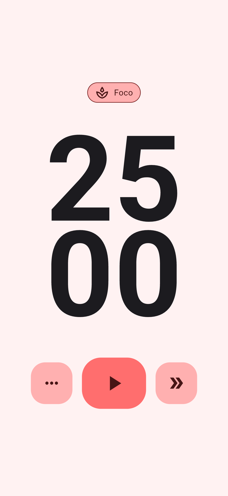
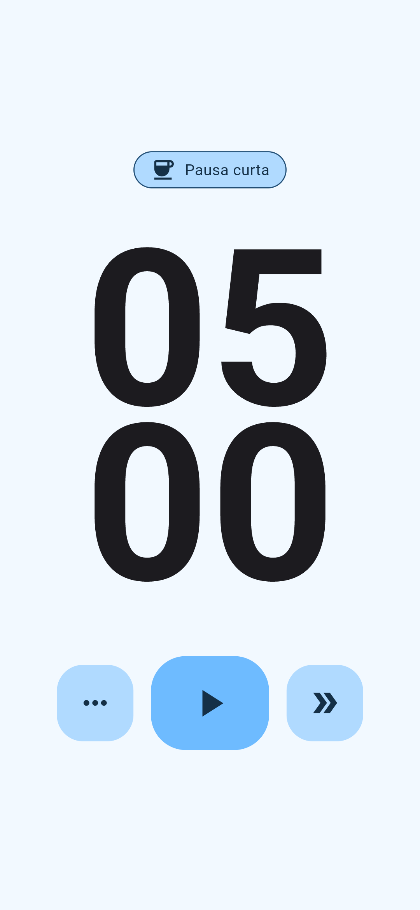

# Pomodoro

#### Pomodoro é uma ferramenta de gerenciamento de tempo que ajuda as pessoas a aumentarem sua produtividade por meio de um método de trabalho estruturado em períodos de tempo. O método pomodoro foi desenvolvido no final dos anos 1980 pelo italiano Francesco Cirillo e é baseado em uma abordagem simples e eficaz para manter a concentração e a motivação durante as tarefas.

#### O aplicativo de pomodoro permite que os usuários estabeleçam uma meta de tempo de trabalho e um intervalo de tempo para descanso. A configuração padrão é de 25 minutos de trabalho seguido por uma pausa de 5 minutos. Esse intervalo de tempo é conhecido como um "pomodoro" (tomate, em italiano, nome escolhido em homenagem a um cronômetro em formato de tomate que Cirillo usava para marcar o tempo). Após três "pomodoros" completos, é executada uma pausa mais longa de 15 minutos.

#### Próximas atualizações terão recursos extras, como gráficos de desempenho, notificações, ajuste do tempo de pomodoro, pausa e intervalo, personalização de cores e som, além de registrar o tempo gasto em cada tarefa.

## Screenshots da versão atual do app:

